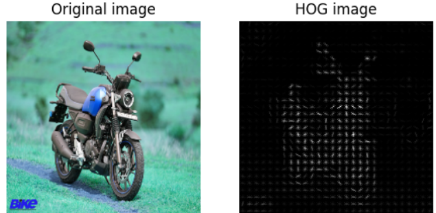
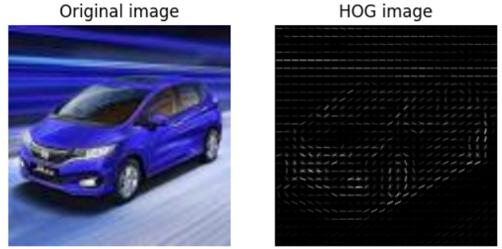
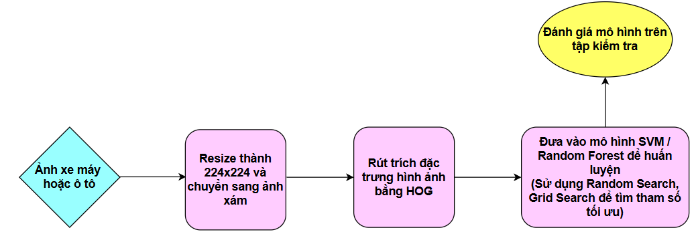
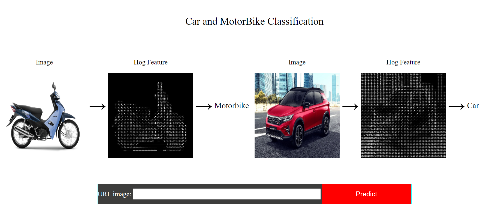

<div align="center">
    <h1>CS231.P11 - Nhập Môn Thị Giác Máy Tính</h1>
    <h2>Giáo viên hướng dẫn: Mai Tiến Dũng</h2>
</div>

## THÀNH VIÊN NHÓM
<a name="thanhvien"></a>
| STT    | MSSV          | Họ và Tên              | Github                                               | Email                   |
| ------ |:-------------:| ----------------------:|-----------------------------------------------------:|-------------------------:
| 1      | 22521184      | Nguyễn Đình Quân       |[nguyenquan132](https://github.com/nguyenquan132)     |22521184@gm.uit.edu.vn   |
| 2      | 22521067      | Hà Hữu Phát            |[mbyhphat](https://github.com/mbyhphat)               |22521067@gm.uit.edu.vn   |

## ĐỒ ÁN MÔN HỌC: Car-Bike-Classification
### **1. Mô tả bài toán**
* Phân loại phương tiện giao thông như xe máy và xe ô tô là một bài toán quan trọng trong lĩnh vực thị giác máy tính, đặc biệt với các ứng dụng
như giám sát giao thông, phân tích lưu lượng và an ninh giao thông. Trong nghiên cứu này, chúng em tập trung vào việc phân loại hai loại
phương tiện chính: xe máy và xe ô tô 
* **Input**: Một ảnh chỉ gồm một chiếc xe máy hoặc một chiếc ô tô và nhãn tương ứng (xe máy hoặc ô tô) với ảnh đó.
* **Output**: Một nhãn do mô hình dự đoán là xe máy hoặc ô tô.

### **2. Công nghệ sử dụng**
- **Ngôn ngữ lập trình**: Python
- **Framework Backend**: Flask
- **Frontend**: HTML, CSS, JavaScript
- **Container hóa**: Docker

### **3. Phương pháp thực hiện**
- Rút trích đặc trưng hình ảnh bằng **Histogram of Oriented Gradients (HOG)**
<p align="center">
    
    
</p>

- Sử dụng các mô hình máy học như **Support Vector Machine (SVM)** và **Random Forest** để thực hiện phân loại

- **Pipeline**: 
<a align="center">
    

### **4. Mô tả dữ liệu**
#### **4.1 Thu thập dữ liệu**
Nhóm sử dụng bộ dữ liệu “Car vs Bike Classification Dataset" thu thập từ kaggle. Bộ dữ liệu gồm 2000 ảnh xe máy và 2000 ảnh ô tô đã được chia thành 2 folder riêng biệt. <br>
Link dataset: [Car vs Bike Classification Dataset](https://www.kaggle.com/datasets/utkarshsaxenadn/car-vs-bike-classification-dataset)
#### **4.2 Xử lý dữ liệu**
Ảnh được xử lý với một số bước sau: <br>
* Resize ảnh về kích thước (224, 224).
* Chuyển đổi ảnh thành Gray Scale. 

Sau khi xử lý, hình ảnh sẽ được rút trích đặc trưng bằng HOG.
### **5. Cài đặt và chạy ứng dụng**
* **Clone repository**: ```git clone https://github.com/mbyhphat/Car-Bike-Classification.git```
* **Pull Docker image từ Docker Hub**: ```docker pull hightfight/initial_cv:latest```
* **Chạy Docker container**: ```docker run -p 8000:5000 hightfight/initial_cv:latest``` (có thể sử dụng port tùy ý ngoài port 8000)
* **Cấu trúc trang web**: 
```
    project/
        ├── app.py
        ├── requirements.txt
        ├── Dockerfile
        └── templates/
            └── index.html/
```
### **6. Kết quả**
|     Model    | Accuracy | Precision | Recall | F1_Score |   
|:------------:|:--------:| ---------:|-------:|----------:
|     SVM      |   0.95   |    0.95   |  0.95  |   0.95   |       
|Random Forest |   0.89   |    0.89   |  0.89  |   0.89   |

Link model: [SVM và Random Forest](https://drive.google.com/drive/folders/166mzq2h52yOkUAnACmglwUUp93DtsjY6?dmr=1&ec=wgc-drive-globalnav-goto)<br>
Demo: 



